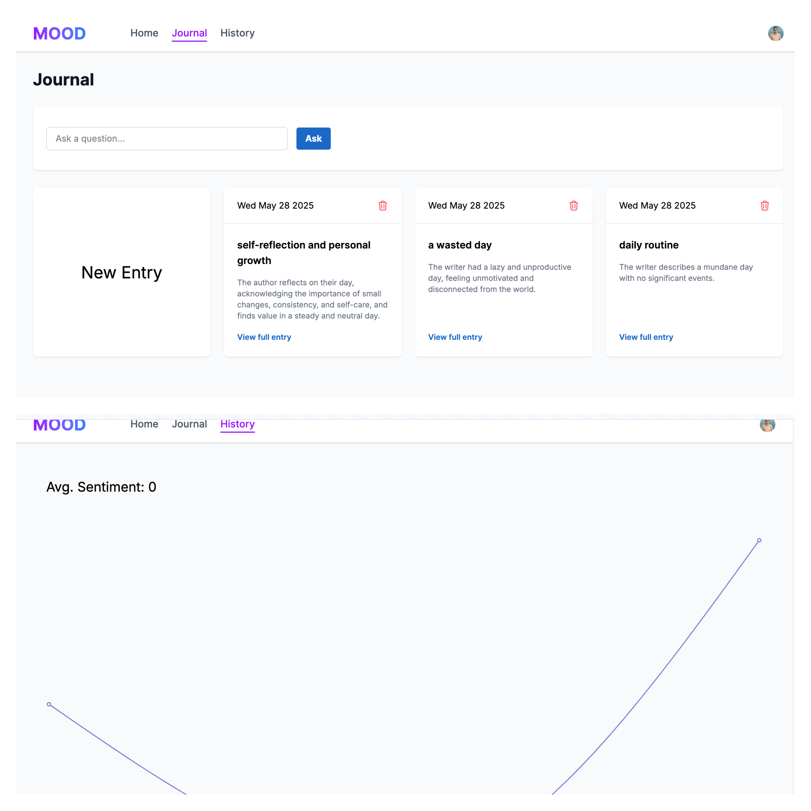

# 🌟 Mood Tracking App

> A modern mood tracking application that helps users monitor their emotional well-being through journaling. The app uses AI to analyze journal entries, providing sentiment analysis, mood tracking, and visual insights into emotional patterns over time.

[](https://nextjs.org/)
[](https://reactjs.org/)
[](https://www.typescriptlang.org/)
[](https://tailwindcss.com/)

## 🚀 Live Demo

Check out the [live demo of the project](https://fullstack-nextjs-journal-ai-app.vercel.app).



## ✨ Key Features

### 📝 Smart Journaling

- ✍️ Create and manage journal entries with real-time autosave
- 🤖 AI-powered analysis of each entry including:
  - 🎯 Mood detection
  - 📌 Subject identification
  - 📊 Sentiment scoring (-10 to 10 scale)
  - 🎨 Automatic color coding based on emotional tone
  - 📝 Concise summaries

### 🎮 Interactive Dashboard

- 🎨 Clean, modern interface with responsive design
- ⚡ Real-time entry creation and editing
- 📈 Visual mood history tracking
- 📊 Sentiment trend analysis
- 🎯 Average sentiment score calculation

### 🧠 AI-Powered Insights

- 🔍 Natural language processing for entry analysis
- 💭 Smart question answering about your journal history
- 🤖 Integration with multiple AI models (Groq and Gemini)
- 📊 Automatic sentiment scoring and mood detection

### 📊 Data Visualization

- 📈 Interactive line charts showing mood trends
- 🎨 Color-coded entries based on emotional tone
- 📊 Historical sentiment analysis
- 📈 Visual representation of emotional patterns

## 🛠️ Technical Stack

| Category               | Technologies                        |
| ---------------------- | ----------------------------------- |
| **Frontend**           | Next.js 15.3.2 with React 19        |
| **Backend**            | Serverless architecture with Prisma |
| **Database**           | PostgreSQL with Prisma ORM          |
| **Authentication**     | Clerk                               |
| **AI Integration**     | LangChain, Google Gemini, Groq      |
| **Data Visualization** | Recharts                            |
| **Styling**            | Tailwind CSS                        |
| **Validation**         | Zod                                 |

## 🚀 Getting Started

1. **Clone the repository:**

   ```bash
   git clone https://github.com/momensalama/fullstack-nextjs-journal-ai-app.git
   ```

2. **Install dependencies:**

   ```bash
   npm install
   ```

3. **Set up environment variables:**

   ```bash
   # Create a .env file with the following variables
   DATABASE_URL="your_database_url"
   CLERK_SECRET_KEY="your_clerk_key"
   GROQ_API_KEY="your_groq_key"
   GEMINI_API_KEY="your_gemini_key"
   ```

4. **Run the development server:**
   ```bash
   npm run dev
   ```

## 📁 Project Structure

```
mood-app/
├── app/              # Next.js application routes and components
├── components/       # Reusable React components
├── utils/           # Utility functions and AI integration
├── prisma/          # Database schema and migrations
└── public/          # Static assets
```

## 🤝 Contributing

Contributions are welcome! Please feel free to submit a Pull Request. For major changes, please open an issue first to discuss what you would like to change.

## 📝 License

This project is licensed under the MIT License - see the [LICENSE](LICENSE) file for details.
